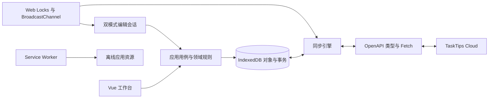
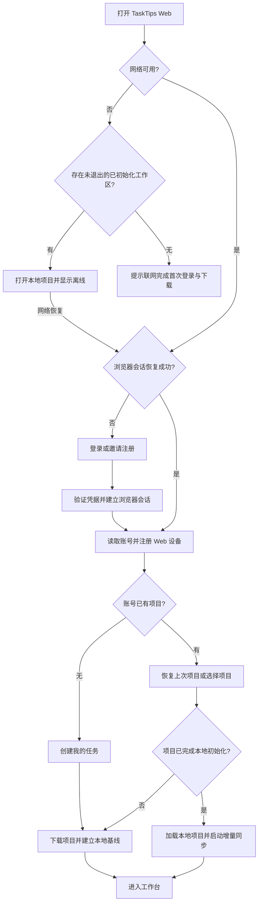
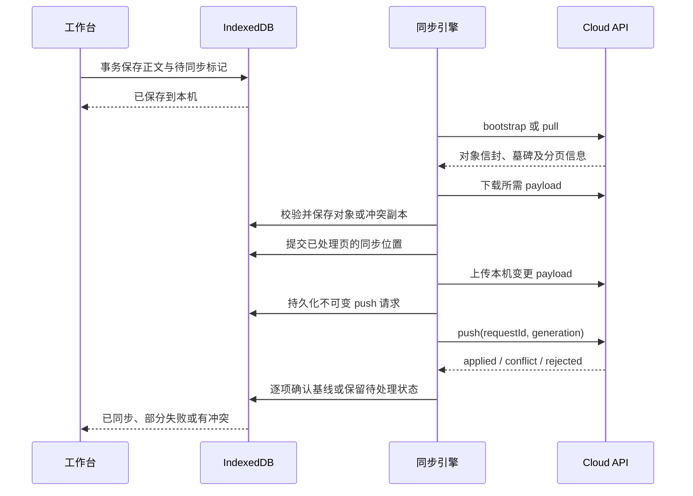

# TaskTips Web 产品与前端设计

> 版本：v0.2；日期：2026-09-18；状态：设计文档与 HTML 交互稿已建立，正式业务功能尚未实现。
> 面向普通用户的浏览器客户端。功能对齐桌面端和移动端，交互针对网页调整；本文不表示相关代码或后端扩展已交付。

界面入口：[Web 设计稿总览](../design/index.html)；交付说明：[design/README.md](../design/README.md)。全部页面、路由和状态的对应关系见[第 14 节](#html-designs)。

## 1. 定位与设计依据

TaskTips Web 提供“受邀注册、登录即用、离线记录、多端接续”的任务工作台。首次进入需要联网认证，不提供匿名工作区；项目完成下载后，在未主动退出登录的情况下可离线重开和编辑。

### 1.1 已确定的产品决策

- 注册采用管理员邀请激活，不提供开放注册。
- 完整离线工作区：任务、分类、标签、图片和待同步修改保存在浏览器本地。
- 界面采用侧栏、任务列表、详情编辑区，默认中文，支持浅色、深色和跟随系统。
- 编辑器提供“即时编辑”和“左侧 Markdown 源码、右侧实时预览”两种可切换模式。
- Web 端连接部署时指定的同源后端，用户不需要填写服务端地址或配置同步协议。
- 后端增加普通用户浏览器会话接口；现有桌面端、移动端认证和同步契约保持兼容。

### 1.2 调研基线

调研时三个兄弟仓库均无工作区修改。后续实施须重新检查契约差异，不能把本文的版本记录当作接口永久冻结。

| 仓库 | 调研提交 | 主要依据 |
| --- | --- | --- |
| `tasktips` | `4eeb2a2` | [桌面设计](../../tasktips/docs/tasktips-design.md)、[领域与存储实现](../../tasktips/src-tauri/src/)、[Vue 界面](../../tasktips/src/) |
| `tasktips-mobile` | `6046da7` | [移动端设计](../../tasktips-mobile/docs/tasktips-mobile-design.md)、[功能对齐设计](../../tasktips-mobile/docs/tasktips-mobile-parity-design.md)、[实际实现](../../tasktips-mobile/lib/) |
| `tasktips-cloud` | `3f3779a` | [OpenAPI](../../tasktips-cloud/contracts/openapi.yaml)、[路由实现](../../tasktips-cloud/crates/api/src/routes.rs)、[部署配置](../../tasktips-cloud/deploy/Caddyfile) |

HTTP 字段以 OpenAPI 为准，数据兼容结合代码、测试夹具和设计规则核对。移动端设计中的“尚未实现”、旧存储参考中的“服务端同步未实现”等状态已落后于代码，不直接沿用。旧分类文档中“删除标签立即移除引用”的概述，也不替代当前“软删除保留引用、彻底删除移除引用”的实现。

### 1.3 首版边界

首版覆盖个人任务管理及现有云端能力，不增加多人协作、看板、日历、重复任务或通知提醒。桌面托盘、置顶透明窗口、窗口吸附、开机启动、云盘目录同步，以及 Android 分享入口、后台调度和 APK 更新不移植到网页。

“完整离线”指已初始化项目的本地操作闭环。注册登录、设备管理、首次下载项目、拉取未缓存的历史、创建云端快照和云端恢复仍要求联网。关闭网页后不承诺自动同步。

## 2. 功能对齐矩阵

| 能力 | 桌面端现状 | 移动端现状 | Web 首版设计 |
| --- | --- | --- | --- |
| 账号入口 | 可本地使用，另行连接云端 | 可本地使用，另行连接云端 | 邀请激活或登录后进入项目 |
| Markdown 编辑 | Milkdown 即时编辑 | 源码编辑／预览切换 | 即时编辑与源码／预览分栏切换 |
| 自动保存、撤销重做 | 已有 | 已有 | 本地自动保存；跨编辑模式保留会话历史 |
| 今日、列表、搜索筛选 | 已有 | 已有 | 侧栏固定视图、常驻搜索和筛选工具栏 |
| 三级目录、标签、分组、颜色 | 已有 | 已有 | 侧栏导航及管理面板，保留领域约束 |
| 自定义排序 | Inbox／All 拖拽 | 已有长按拖拽 | 拖动手柄；搜索、筛选或显式排序时禁用 |
| 图片 | 导入并保存，编辑器显示占位 | 导入、同步和本地预览 | 选择、粘贴、拖入；显示本地图片 |
| 回收站 | 任务、目录、标签 | 已有 | 独立页面，30 天保留，恢复与彻底删除 |
| 服务端同步与冲突 | 已有服务端适配和冲突界面 | 已有 | 浏览器本地对象库与同一云端协议同步 |
| 设备管理、修改密码 | 现有界面未完整覆盖 | 已有 | 账号设置与设备列表 |
| 对象历史、快照、云端恢复 | 现有界面未完整覆盖 | 已有 | 复用后端接口，置于数据管理区 |
| 本地内容备份 | 本地内容目录 | ZIP 导出／恢复 | 下载和上传兼容 ZIP 备份 |
| 平台能力 | 托盘、浮窗等 | Android 分享、后台任务等 | URL 导航、键盘、响应式布局、离线应用资源 |

Web 按已实现的共同业务规则及移动端补齐能力对齐，不把旧规划中的标签合并、批量管理等功能自动加入首版。

## 3. 信息架构与页面

### 3.1 页面与路由

应用部署在 `/app/`。所有项目路由先验证当前账号归属；未登录时进入登录页，认证成功后仅恢复本站合法目标路径。

| 路由 | 页面职责 | HTML 设计稿 |
| --- | --- | --- |
| `/app/login` | 邮箱、密码登录；邀请注册入口 | [登录](../design/login.html) |
| `/app/register` | 输入邀请凭据、设置密码并激活；不接受任意邮箱自助建号 | [邀请注册](../design/register.html) |
| `/app/projects` | 首次多项目选择、新建及重命名项目 | [项目](../design/projects.html)、[初始化](../design/onboarding.html) |
| `/app/p/:projectId/:view` | `today`、`inbox`、`upcoming`、`all`、`completed` 工作台 | [今日](../design/today.html)、[收件箱](../design/inbox.html)、[即将到期](../design/upcoming.html)、[全部](../design/all.html)、[已完成](../design/completed.html) |
| `/app/p/:projectId/todo/:todoId` | 任务直达；宽屏加载工作台与详情，窄屏全屏详情 | [即时编辑](../design/editor.html)、[分栏编辑](../design/editor-split.html) |
| `/app/p/:projectId/classification` | 目录、标签和标签分组管理 | [目录](../design/classification.html)、[标签与分组](../design/tags.html) |
| `/app/p/:projectId/trash` | 任务／目录／标签回收站 | [回收站](../design/trash.html) |
| `/app/p/:projectId/sync` | 同步状态、冲突、本机执行日志 | [同步](../design/sync.html)、[冲突处理](../design/conflicts.html) |
| `/app/p/:projectId/history` | 项目历史及对象历史筛选 | [历史](../design/history.html) |
| `/app/p/:projectId/snapshots` | 快照列表、创建和恢复任务 | [快照](../design/snapshots.html)、[恢复流程](../design/restore.html) |
| `/app/settings` | 账号、设备、外观、编辑、本地存储及备份 | [外观编辑](../design/settings.html)、[账号](../design/account.html)、[设备](../design/devices.html)、[存储备份](../design/storage.html) |

视图、目录和选中任务可通过 URL 恢复。自由文本搜索保留在本地会话中，不写入 URL，避免任务内容进入访问日志；服务端不得记录认证请求正文。浏览器前进后退保留当前列表的筛选、选中项和滚动位置。

### 3.2 工作台布局

```text
┌────────────────────────────────────────────────────────────────────┐
│ TaskTips  [我的任务 ▾]              [搜索]  [新建任务]  [账号 ▾]    │
├──────────────┬───────────────────┬─────────────────────────────────┤
│ 今日         │ 今日  8 项        │ 标题摘要        [专注] [更多]   │
│ 收件箱       │ [筛选] [排序]     │ [即时 | 分栏]  已保存／同步状态 │
│ 即将到期     │                   │ 日期 · 优先级 · 目录 · 标签     │
│ 全部／已完成 │ □ 过期任务        │                                 │
│ 目录树       │ □ 今日任务        │ 即时编辑正文                    │
│ 标签分组     │ □ ...             │ 或左侧源码、右侧预览            │
│              │                   │                                 │
│ 回收站       │                   │                                 │
│ 同步与数据   │                   │                                 │
└──────────────┴───────────────────┴─────────────────────────────────┘
```

- 视口宽度 ≥1280px：侧栏默认 224px，任务列表默认 336px，详情占剩余宽度。侧栏、列表可收起，列分隔支持拖动。
- 768–1279px：侧栏默认收起；列表和详情根据空间并排或替换展示，保留返回列表入口。
- <768px：抽屉导航、单页列表和全屏详情。详情页不挤占屏幕显示长期侧栏。
- 专注编辑收起侧栏和列表；退出恢复原布局。分栏是否并排取决于编辑区实际宽度，不只取决于视口。
- 新用户无项目时创建“我的任务”；单项目直接进入；多项目恢复上次可访问项目，无记录时展示选择页。项目初始化失败提供重试，不创建匿名项目绕过认证。
- 项目切换使用独立本地分区，不把当前项目内容自动并入另一项目。切换前持久化编辑，未同步队列保留在原项目并显示数量。

### 3.3 状态与可访问性

分别设计初次加载、空项目、无搜索结果、离线、只读、保存失败、同步失败、冲突和项目维护状态，不使用同一空白页代替。错误提示提供重试、重新登录、查看冲突或导出内容等相关操作。

浅色品牌色 `#0078D4`、深色 `#4A9EFF`；采用语义化颜色令牌。表单具有明确标签，状态不只依赖颜色，浮层管理焦点并在关闭后归还。窄屏主要操作热区不小于 44px，支持系统字号和减少动画。

快捷操作默认使用 `Ctrl/Cmd+K` 打开命令面板、`Ctrl/Cmd+S` 刷新本地保存、`Esc` 关闭当前浮层。新建使用按钮和命令面板，不覆盖浏览器的 `Ctrl/Cmd+N`、`Ctrl/Cmd+L` 或打印快捷键。

## 4. 核心业务规则

### 4.1 任务与查询

- 任务状态为 `open`／`completed`，优先级 `0/1/2/3` 对应无、低、中、高；完成设置 `completedAt`，取消完成清空它。
- 收件箱是全部未完成任务；今日为未完成且 `dueDate <= 本地今天`，按过期／今天分组；即将到期为未来有截止日期的未完成任务；普通视图排除回收站。
- `dueDate` 是 `YYYY-MM-DD` 日历日期，不转换成 UTC 时间；跨午夜、时区变化和恢复前台时重算视图。截止日期不代表通知提醒。
- 搜索覆盖标题、正文纯文本和标签，大小写不敏感，保留代码块内容可搜索。目录筛选包含子目录；已选目录与“未分类”取并集，各筛选维度之间取交集。
- 标签支持全部包含／任一包含／均不包含，默认全部包含；优先级多选取并集。清除筛选同时清除搜索并恢复默认排序。
- 默认排序依次为未完成、过期、优先级降序、截止日期升序、更新时间降序；无日期排最后。显式排序支持更新时间、创建时间、截止日期、优先级和标题的升降序。
- 自定义顺序只写入 `index.customOrder.inbox/all`；数组中已有任务按相对顺序优先显示，其余按默认规则追加。写回保留已有软删除 ID，不把筛选结果覆盖成全量顺序。
- 从今日新建预填今天日期，从目录／标签入口新建继承分类；普通列表新建不预填截止日期。未输入内容的新建任务离开时丢弃；若已传播到云端则通过墓碑收敛。

### 4.2 目录、标签与删除

目录最多三级；目录名 trim 后按 Unicode 码点计数为 2–50 字符，禁止 `/`、`\`、`:`、`*`、`?`、`"`、`<`、`>`、`|`。同级名称大小写不敏感唯一，移动不得形成循环，目标父层级加整棵子树高度不得超过三级。“未分类”是保留视图，不作为可删除目录实体。

标签名为 1–20 字符、全局大小写不敏感唯一；任务保存标签名称而非标签 ID。重命名更新全部相关任务，包括回收站任务。标签分组是 `group` 字符串，不另建同步实体；空组归“其他”，删除分组只把标签移入“其他”。颜色使用既有 32 色 hex 色板。

移入回收站需确认。删除目录时展示影响数量，整棵有效子树及其中未删除任务使用同一删除时间标记；恢复只恢复同批内容，不复活此前单独删除的任务。标签软删除保留任务引用，彻底删除才移除引用；系统标签不可删除。

回收站固定保留 30 天，展示删除时间和剩余天数。应用启动、恢复前台及运行中的每日检查触发到期清理，不承诺网页关闭时按时清理。恢复保持原 ID 和关联，缺失目录按未分类展示；同名冲突保留回收站条目并提示处理，不覆盖现存分类。

彻底删除任务时，本地事务先可靠记录墓碑，再删除对象与派生索引；不存在于缓存不等于被删除。墓碑按既有协议保留 90 天，尚未同步确认的本机删除意图不得因到期静默丢弃。目录、标签删除通过 `classification` 对象传播，不新增同步 kind。

## 5. 双模式编辑器

### 5.1 模式与布局

交互参考：[即时编辑稿](../design/editor.html)、[左右分栏稿](../design/editor-split.html)。两份 HTML 是同一编辑器的两种初始状态，产品实现不应因此创建两个独立任务或两套正文。

编辑区顶部常驻分段按钮“即时／分栏”，默认即时。模式、分栏比例和同步滚动偏好按账号保存在当前浏览器，不写入任务或云端同步对象。

| 模式 | 内容呈现 | 操作 |
| --- | --- | --- |
| 即时 | Milkdown／ProseMirror，即时呈现当前 Markdown 内容 | 原位编辑、格式命令、直接勾选任务清单、显示本地图片 |
| 分栏 | 左侧 CodeMirror 6 Markdown 源码，右侧实时只读预览 | 在源码中编辑，预览核对结果；初始左右各 50%，支持拖动调整 |

```text
即时模式                            分栏模式
┌───────────────────────┐          ┌─────────────────────────────────┐
│ [即时] [分栏]  [专注] │          │ [即时] [分栏] [同步滚动✓][专注]│
│ 日期 · 标签 · 优先级  │          │ 日期 · 标签 · 优先级            │
├───────────────────────┤          ├────────────────┬────────────────┤
│ 今日工作              │          │ # 今日工作     │ 今日工作       │
│ ☐ 完成设计            │          │ - [ ] 完成设计 │ ☐ 完成设计     │
│ 可直接编辑与勾选      │          │ Markdown 源码  │ 只读预览       │
└───────────────────────┘          └────────────────┴────────────────┘
```

编辑区宽度 ≥720px 时分栏并排，每栏最小 320px；不足时显示“编辑／预览”页签，仍属于分栏模式。恢复宽度后恢复并排和上次比例，不改变用户选择的模式。专注编辑可扩大分栏空间。

分栏预览随输入更新，默认 100ms 合并渲染，过期计算结果不覆盖新内容。同步滚动默认开启，按 Markdown 块的源行与预览节点定位，图片加载后更新映射；用户可关闭。预览中的任务框只读，点击不改变源码；编辑清单使用左侧源码或即时模式。

### 5.2 正文与模式切换

Markdown 是唯一正文权威格式，不持久化另一套 HTML／富文本正文。不设置独立标题输入框；从前 50 行中寻找首个有可见内容的行，剥离 Markdown 标记，最多 80 个 Unicode 码点，超长取 79 个加省略号；空标题仅显示“未命名 Todo”。

两种模式共享任务级 `EditorSession`：当前正文、编辑序号、已保存序号、公共撤销栈，以及两种模式各自的选区和滚动位置。Milkdown 和 CodeMirror 作为输入适配器；格式按钮作用于当前活动编辑器。

1. 切换时先将当前编辑事务提交到共享正文，再更新另一模式的显示。
2. 中文输入法 composing 期间延后切换，等待 `compositionend`；不通过强制重建输入框截断输入。
3. 返回原模式时恢复其选区与滚动位置；首次进入该模式定位至对应正文段落，无法映射时保留内容并定位相邻可用位置。
4. 模式切换、挂载和预览重算都不是内容修改，不递增任务 revision、不改写原始字节、不发起无变化上传。
5. 无法在即时模式中无损表达的语法保留原始片段；该片段通过源码编辑，不因渲染而删除或替换。原始 HTML 只作为文本内容保存，不执行。

撤销／重做由共享会话记录正文变更，两个适配器的命令统一委托会话，程序化回放不再次入栈；连续输入按事务合并，模式切换不入栈、不清空历史。历史仅限本次任务编辑会话，离开任务后结束，不属于云端版本历史。

### 5.3 自动保存与安全渲染

停止输入 400ms 后写入 IndexedDB，连续输入最长 2 秒持久化一次；离开任务或隐藏页面时尽力刷新，但正确性不能依赖退出回调。组合输入期间不重设正文或选区。

本地事务成功后才显示“已保存到本机”。每次保存绑定编辑序号，同任务串行执行；旧回执只确认对应序号，不能把后续输入标记为已保存。失败保留会话内容，显示重试和导出正文；站内导航不得直接丢弃尚未持久化的内容。

两种模式支持 CommonMark＋GFM 的标题、强调、删除线、列表、任务清单、引用、代码、链接、表格和图片，使用一致的语法与安全规则。预览通过结构化节点白名单生成，禁用危险协议和 HTML 执行；新窗口链接添加 `noopener noreferrer`。

图片通过文件选择、粘贴或拖入导入，检查文件头及 PNG／JPEG／GIF／WebP／BMP 白名单，拒绝 SVG，单个文件不超过 10 MiB。生成 `images/<ulid>.<ext>` 引用，以二进制保存并通过 Blob URL 展示，释放时回收 URL。外部图片默认显示占位，不自动联网加载；删除引用不自动删除图片对象，避免破坏其他任务或历史引用。

## 6. 技术架构与模块边界

| 层次 | 选型与职责 |
| --- | --- |
| 界面 | Vue 3、TypeScript、Vue Router、Pinia；任务工作台及可访问的基础组件 |
| 编辑 | Milkdown、CodeMirror 6、共享 EditorSession、Markdown 解析与预览适配 |
| 应用与领域 | 查询、分类生命周期、标题派生、任务修改和备份用例；不依赖 DOM |
| 持久化 | IndexedDB／Dexie；事务、原始字节、对象索引、图片与恢复副本 |
| 同步 | 对象编排、冲突、请求幂等、连接代次、跨标签页协调 |
| HTTP | Fetch 传输层，openapi-typescript 从唯一 OpenAPI 生成类型 |
| 离线资源 | Service Worker、应用 manifest、版本化静态资源缓存 |
| 工程与测试 | Vite、ESLint、Prettier、Vitest、Vue Test Utils、Playwright |

建议结构为 `src/{app,pages,components,editor,domain,application,storage,sync,api,styles}`、`tests/{fixtures,e2e}` 和 `public/`。可复用桌面端的纯工具函数、主题令牌及兼容夹具；依赖 Tauri IPC、窗口或文件系统的组件必须通过适配层重构，不能直接搬入。



Pinia 是界面状态投影，不替代持久化数据库；只有事务完成后才广播已保存状态。网络请求不放在 IndexedDB 事务内等待，避免事务失活，也不长期阻塞本地编辑。

## 7. 数据兼容与浏览器持久化

### 7.1 项目内容格式

| 对象 | 标识与权威内容 | 约束 |
| --- | --- | --- |
| Todo | kind=`todo`，id 为 ULID；完整 Markdown＋YAML front matter | 内容 schemaVersion=1；完整 payload ≤8 MiB |
| 分类 | kind=`classification`，id=`classification`；分类 JSON | 内容 schemaVersion=3；≤5 MiB |
| 索引 | kind=`index`，id=`index`；排序与墓碑 JSON | 内容 schemaVersion=1；≤5 MiB |
| 图片 | kind=`image`，id 为 `<ulid>.<ext>` 文件名 | 原始二进制；≤10 MiB |

**内容版本与同步信封版本必须区分**：当前移动端发送的四类对象信封 `schemaVersion` 均为 1，不能把分类内容的 v3 直接写成信封 v3。HTTP 信封字段与对象内容字段分别转换和验证。

Todo 保留 `id/title/status/priority/tags/dueDate/categoryId/deletedAt/createdAt/updatedAt/completedAt/revision/deviceId` 及未知 front matter 字段。任务的 `deviceId` 保留创建设备，同步信封的 `deviceId` 表示本次提交设备。时间戳遵循 RFC 3339 UTC，日期字段保持日历日期；保留读取到的未修改时间戳原文。

分类保留实体 ID、父目录、名称、颜色、图标、描述、顺序、标签分组、系统标志、时间戳及实体未知字段，兼容 v1／v2 升级。索引的 `customOrder` 保持 `inbox/all` 键域；同步规范形态采用递归键排序、两空格缩进并排除本机 `lastScanAt`。墓碑保留既有字段和 `projectId`，不能只用现存任务重建删除记录。

下载先校验原始字节 SHA-256，再解析内容；只读操作不重写 payload。真实修改才序列化为兼容的 UTF-8／LF 格式，哈希与上传使用同一份字节。解析失败或新版本不支持时保留原件，受影响对象只读；索引墓碑可靠性不明时暂停项目自动推送，防止错误覆盖远端。

编辑器的本地 `editSequence` 用于识别新旧保存结果，不能代替 Todo 内容 revision 或远端对象 revision。远端基线必须独立保存，不能用当前本地 revision 推断上次已同步状态。

### 7.2 IndexedDB 逻辑分区

浏览器 origin 是外层隔离边界；内部使用 `userId + projectId` 命名空间，未认证身份不能指定任意命名空间读取数据。

| 存储区 | 保存内容 |
| --- | --- |
| 项目与账号元信息 | 已验证账号、设备 ID、已下载项目、初始化状态和活动快照指针 |
| 原始对象与图片 | kind、对象 ID、原始字节或 Blob、内容哈希、解析状态 |
| 任务查询投影 | 从原始内容派生的摘要、日期、状态、标签和搜索文本；可重建 |
| 同步状态 | generation、cursor、远端 revision/hash 基线、已拒绝对象 |
| 待提交请求 | requestId、generation、不可变请求内容及其 payload 引用 |
| 墓碑与恢复副本 | 未确认删除意图、冲突双方、损坏原件、导入前内容快照 |
| 本机偏好 | 主题、编辑模式、分栏比例、列表状态；不上传 |

任务原文、投影及待同步标记在同一事务更新；目录级联删除和标签重命名涉及多个对象，也以事务更新本地状态。原始字节是可导出和可同步的依据，不能仅保存渲染后的 HTML 或列表摘要。

数据库升级使用显式版本迁移。升级前等待其他标签页释放连接；失败保留旧数据并进入恢复提示，不自动删库重建。磁盘不足时不得清除尚未同步内容、未确认墓碑或唯一恢复副本来腾空间。

## 8. 注册、登录与会话

### 8.1 用户流程



邀请页输入邀请凭据、新密码和确认密码，新密码至少 12 字符；账号邮箱由邀请绑定，不能通过表单替换成另一个账号。邀请链接使用 `/app/register#invitation=...`，前端取出后立即移除地址中的凭据，仅在当前注册会话内保存。失效、已使用或被撤销邀请统一提示联系管理员重新邀请。

激活成功即获得会话，不要求再次输入密码。若激活已经成功但响应丢失，提示使用受邀邮箱登录，不反复生成账号。首版不设计自动发送邀请邮件和自助密码找回；管理员通过既有邀请能力提供凭据。

登录后依次读取 `/me`、注册 `platform=web` 的设备并获取项目。设备 ID 按浏览器安装及账号隔离，清除网站数据后生成新设备身份，不从备份恢复旧身份。刷新页面不重复创建设备。

### 8.2 新增浏览器接口：待后端实现

以下接口目前不存在，实施时必须先更新 `tasktips-cloud` 的 OpenAPI、路由和认证测试。复用普通用户的密码验证、邀请激活、令牌轮换、账号状态和设备撤销规则，不复用管理员角色入口。

| 接口 | 请求 | 成功结果 |
| --- | --- | --- |
| `POST /api/v1/web/auth/login` | `email/password/deviceId` | 200：`accessToken/expiresIn`，同时设置刷新 Cookie |
| `POST /api/v1/web/auth/invitations/activate` | `invitationToken/password/deviceId` | 200：同上，完成邀请激活 |
| `POST /api/v1/web/auth/refresh` | 无 JSON 凭据，读取 Cookie | 200：新的 access token 与轮换后的 Cookie |
| `POST /api/v1/web/auth/logout` | 通过 Cookie 定位 Web 会话，不要求有效 access token | 204：撤销对应设备会话并清除 Cookie；重复注销可成功 |

新增独立的 `WebTokenResponse`，不借用 `AdminTokenResponse` 表达普通用户身份。保留现有 `/api/v1/auth/*` 的 JSON 令牌响应供桌面和移动端使用，不改变其请求格式。

浏览器刷新 Cookie 名为 `tasktips_web_refresh`，设置 `HttpOnly; Secure; SameSite=Strict; Path=/api/v1/web/auth`，不设置 Domain，Max-Age 跟随后端刷新期限。前端脚本不读取或持久化刷新令牌；access token 仅在内存，业务接口继续使用 Bearer 认证。

新增 `TASKTIPS_WEB_ORIGIN` 精确配置允许的 Web origin；上述四个接口校验 Origin，并拒绝跨站 Fetch Metadata。Cookie 接口使用 POST、拒绝非预期请求格式，不放开任意 CORS。认证响应设置 `Cache-Control: no-store`。后端 Cookie 清理和设置使用相同属性。

### 8.3 刷新、退出与离线身份

- 多标签页共用一个 Web 账号会话。认证操作使用 origin 级互斥锁；刷新串行，成功后广播账号和会话代次。不同账号登录使旧标签页退出旧会话。
- 离线重开使用此前已验证且未退出的本地账号，不代表当前云端授权仍有效；网络恢复后先刷新会话和检查身份，再执行云端操作。
- access token 过期先尝试一次刷新；网络错误允许继续本地编辑。终局凭据失效要求重新登录，账号禁用或设备撤销停止编辑和云端操作，保留已有本地改动供恢复，不静默删除。
- 修改密码调用既有 `/me/password`；成功后清理浏览器会话并要求重新登录，提示其他设备也需重新登录。
- 退出默认清理该账号的本地内容及内存状态。存在未同步内容时提供“同步后退出”“导出后退出”“明确丢弃后退出”及取消，禁止无提示清除。
- 离线退出立即阻止工作区访问并记录待远端注销标记；HttpOnly Cookie 只能由服务端清理。下次联网先执行注销，成功前不允许通过该 Cookie 自动恢复会话，并明确远端撤销尚未确认。
- 退出、切换账号和重建项目上下文增加连接代次并停止旧任务；旧响应不能写入新上下文。注销与刷新共用认证锁，避免较晚的刷新响应重新恢复退出状态。

离线存储默认不做应用级加密，不声称具备操作系统安全存储能力；登录页说明数据会保留在当前浏览器，公共设备使用后应退出并清理。

## 9. 同步与多标签页协调

### 9.1 初始化与增量流程



首次项目下载采用暂存快照，处理所有 bootstrap 分页及必要 payload。最终页完成并可靠落库后，才启用返回的 cursor 和新快照；失败可重试，不把半份快照标为初始化完成。初始化完整离线工作区需要下载当前对象及图片，显示进度和失败项，历史 payload 按需下载。

pull 每页先下载、校验并保存对象、墓碑或完整冲突副本，再推进该页 cursor。下载损坏、存储失败不得跳过对象推进游标。收到远端修改时检查本机未保存编辑和待提交版本，不直接覆盖输入框。

上传先通过 payload HEAD／PUT 确认内容存在，再 push 元信息；每批最多 100 个对象与墓碑合计，保守满足现有数组限额。requestId 使用唯一 ID，对应的请求正文和字节引用持久化后不可修改；响应丢失原样重试，新编辑另建后续请求。

逐项处理 `applied/conflict/rejected`。保存已确认基线时再次检查本地编辑序号，若请求发出后还有修改，仍保留待同步标记。被拒内容在用户修改或明确修复前不无限重试，不因一条超限阻断其他对象。

### 9.2 冲突与恢复

Todo、classification、index、image 均按整对象处理冲突，不自动进行字段合并或按客户端时间最后写入覆盖。对比面板展示本机和远端版本，提供“保留本机／采用远端”；分类和索引冲突说明影响目录、标签或排序，删除冲突明确显示“此版本为删除”。

决定前重新校验双方版本；版本变化则刷新对比。采用任一版本仍保留恢复副本，保留本机时以最新远端基线提交并使用幂等请求。同步 index 时不得丢弃本机尚未确认的墓碑；已经接受的远端删除不能因扫描缺失重新生成旧任务。

`GENERATION_MISMATCH` 或发现 generation 改变时，停止旧请求，保存本机待处理内容，废弃旧游标及请求上下文并重新 bootstrap。云端项目恢复后展示重新接入确认，由用户决定如何处理旧本机改动，不能自动把旧队列推回去抵消恢复结果。

### 9.3 调度、错误与并发

自动同步默认开启，启动、恢复前台、网络恢复、本地保存后触发，前台每 60 秒检查；触发合并为项目单飞任务。关闭自动同步保留本地操作和手动同步入口。网络及可重试错误采用 30 秒至 5 分钟退避，遵守服务端限流提示。

| 情况 | 行为 |
| --- | --- |
| 断网／可重试服务失败 | 保留本地写入，显示待同步并退避 |
| `AUTHENTICATION_REQUIRED` | 刷新一次；终局失败要求重新登录 |
| `ACCOUNT_DISABLED`／`DEVICE_REVOKED` | 停止认证及同步重试，显示明确原因 |
| `PROJECT_MAINTENANCE` | 暂停项目提交，本地草稿保留，提示维护后重试 |
| `GENERATION_MISMATCH`／`CURSOR_INVALID` | 停止当前增量流程，保留改动并重新初始化 |
| `REVISION_CONFLICT` | 转入冲突处理，不覆写远端 |
| 哈希错误／超限／不支持的 schema | 保留原内容、标注具体对象，停止该对象自动重试 |
| `IDEMPOTENCY_CONFLICT` | 停止复用异常请求 ID，核对远端结果后重建请求 |

使用三类 Web Locks：origin 级认证锁、账号项目级同步锁、任务编辑会话锁；任务锁覆盖即时与分栏两种模式。另一个标签页打开已编辑任务时只读展示并提示持有者，不直接抢锁；关闭编辑会话后可重试获取。短事务及本地编辑序号检查处理同步写回并发。

BroadcastChannel 只发送账号代次、项目／对象标识和失效通知，不广播正文或刷新令牌。认证锁内只做认证，项目同步可按固定顺序请求认证锁，认证流程不反向等待项目锁，防止循环等待。浏览器缺少必要协调能力时阻止可写离线工作区，提示使用支持的浏览器，不以 localStorage 竞争伪装可靠锁。

同步状态包含待同步、同步中、已同步、离线、部分失败、有冲突、需登录和维护中。存在未上传内容、失败项或冲突时不能显示全部同步成功。日志只记时间、方向、数量、错误码和 requestId，不记录正文或凭据。

## 10. 历史、快照与备份

### 10.1 历史和云端恢复

项目历史与对象历史按 `afterSequence` 分页，默认每页 200 条。列表只加载信封；点击某条记录才下载对应 payload，展示只读正文或图片，墓碑标记为删除版本。首版不新增单对象历史恢复接口。

快照页支持查看状态和立即创建快照。恢复支持选择 ready 快照或目标 `changeSequence`；原因必填，trim 后 1–512 字符。确认文案明确恢复作用于整个项目及所有设备，先保存本机内容和未提交修改。

恢复提交返回任务后，每 2 秒查询一次状态，离开页面停止轮询但不取消服务端任务；再次打开按任务 ID 恢复查询。超时或网络失败显示可重试状态，不能推断恢复已经失败。取消请求同样填写原因，等待任务终态，不能把“已请求取消”显示成“已取消”。成功后走 generation 更新与重新接入流程。

### 10.2 本地备份

通过下载文件导出 ZIP，通过文件选择导入，兼容移动端 `tasktips-backup` 的 `formatVersion: 1`：根级 `manifest.json` 和 `content/tips/*.md`、`content/tips/images/*`、`content/classification.json`、`content/index.json`。

备份不包含账号令牌、设备身份、同步基线、未完成网络请求和本机设置。导出采用一致内容快照，保留 Markdown 原字节及图片二进制。

导入先校验 manifest、路径、对象格式与逐项限额，拒绝绝对路径、目录穿越、重复覆盖和异常解压体积；展示覆盖范围及所需空间，用户确认后建立当前内容恢复副本，再事务切换内容集合。任何验证或写入失败恢复原集合，不形成半份项目。

恢复内容作为当前项目的本机改动重新核对远端，不导入旧设备的提交上下文。新旧内容差异中的删除须在预览中明确确认，不能把缓存文件缺失推断成云端删除。保留恢复前内容供撤回。

## 11. API 对照与部署

### 11.1 现有接口复用

以下为当前契约中的接口，`P` 在本表中表示 `/api/v1/projects/{projectId}`，不是真实 URL 字面量。

| 功能 | 接口 |
| --- | --- |
| 账号、改密码 | `GET /api/v1/me`、`PATCH /api/v1/me/password` |
| 项目列表、新建、详情、重命名 | `GET/POST /api/v1/projects`、`GET/PATCH P` |
| 设备 | `GET /api/v1/devices`、`POST /api/v1/devices/register`、`PATCH /api/v1/devices/{deviceId}`、`POST /api/v1/devices/{deviceId}/revoke` |
| 内容传输 | `HEAD/PUT/GET P/payloads/{contentHash}` |
| 初始化及同步 | `POST P/sync/bootstrap`、`POST P/sync/pull`、`POST P/sync/push` |
| 历史 | `GET P/history`、`GET P/objects/{kind}/{objectId}/history` |
| 快照 | `GET/POST P/snapshots` |
| 恢复任务 | `POST P/restores`、`GET P/restores/{restoreId}`、`POST P/restores/{restoreId}/cancel` |

普通用户界面不调用 `/api/v1/admin/*` 读取任务内容。云端存储地址与凭据不下发浏览器，payload 通过已有鉴权 API 获取。

生成类型来自兄弟后端 OpenAPI，提交可复现的生成结果并记录契约版本；CI 显式获取对应后端契约，不假设构建机器天然存在兄弟目录。业务适配层处理领域模型，避免把传输类型直接作为编辑器状态。

浏览器上传使用已知大小的 Blob／ArrayBuffer，设置正确 Content-Type；不能照搬原生客户端手写 `Content-Length` 或 `Origin`。这两类请求头由浏览器控制，见 [禁止由脚本设置的请求头](https://developer.mozilla.org/en-US/docs/Glossary/Forbidden_request_header)。联调必须验证现有 payload 端点收到自动生成的长度，不能为绕过生成客户端的参数约束而伪造头部。

### 11.2 部署与离线资源

沿用同源入口：`/app/` 反向代理 Web 静态服务，`/api/` 代理后端，`/admin/` 保持管理后台。根路径 `/` 重定向 `/app/`；Web history fallback 只在 `/app/` 内生效，不把 API 404 改写为 HTML。

生产要求 HTTPS；开发使用 localhost 和 Vite API 代理，Web 开发端口固定 5174，避免与已有管理后台 5173 冲突。配置 `TASKTIPS_WEB_ORIGIN` 与浏览器实际 origin 一致，前端不保存 RustFS 或数据库凭据。

Service Worker 注册在 `/app/`，只缓存版本化应用外壳与静态资源，不缓存认证响应、API 响应、管理后台或带凭据的下载。业务离线内容统一进入账号隔离的 IndexedDB。API 请求直接联网，由应用层决定使用本地对象；不依赖 Background Sync 完成正确性。

新版本资源下载后提示更新，先完成本地保存，再由用户刷新；不得在输入中自动 reload。数据库迁移与多标签页版本切换协调，失败保留旧内容。CSP 限制脚本和连接来源，图片仅允许所需的本站与 Blob 来源，禁止嵌入执行用户 HTML。

请求 `navigator.storage.persist()` 并通过 `estimate()` 展示存储占用；请求被拒不阻止正常使用，但显示同步与备份建议。浏览器清理、隐私模式和磁盘不足可能使本地数据消失，未上传内容不能从云端恢复，见 [存储配额与清理说明](https://developer.mozilla.org/en-US/docs/Web/API/Storage_API/Storage_quotas_and_eviction_criteria)。

支持当前稳定版及前一个主要版本的 Chrome、Edge、Firefox、Safari，并以 IndexedDB、Service Worker、Web Crypto、Web Locks 和 BroadcastChannel 能力检测为准。不支持的环境显示说明，不静默降级为无法可靠保存的工作区。设备“最近活动”仅展示服务端记录，不表示实时在线。

## 12. 验收与实施顺序

### 12.1 验收矩阵

以下是后续实现必须验证的场景，不表示本次文档交付已经运行应用测试。

| 场景 | 必须满足的结果 |
| --- | --- |
| 有效、失效、重复使用的邀请 | 有效邀请建立普通用户会话；错误邀请不生成额外账号，不暴露其他账号信息 |
| 登录与初次使用 | 新账号自动建立默认项目；已有项目正确恢复；失败可重试 |
| 刷新页面和两标签页刷新会话 | Cookie 轮换有序，不误撤销会话；脚本存储中没有刷新令牌 |
| 在线／离线退出与切换账号 | 本地访问立即终止，旧回调失效；未同步数据经明确处理，离线注销不会自动重新登录 |
| 即时→分栏→即时 | 正文、任务 ID、元数据一致；仅切换不产生额外 revision 或上传 |
| 跨模式撤销／重做 | 已有修改可以连续撤销和重做，切换不清空历史，也不双重记录一次输入 |
| 中文输入法与切换 | composing 完成后再切换，正文、选区和保存顺序正确 |
| 分栏长文、代码、表格、清单、图片 | 左侧源码与右侧预览语义一致，预览不修改正文，旧渲染结果不会闪回 |
| 编辑区域宽度变化 | ≥720px 并排；不足时页签切换；恢复宽度后恢复比例、模式和内容 |
| 自动保存中继续输入、写入失败 | 旧保存不能确认新内容；失败保留草稿，不误报已保存 |
| 离线新建、分类调整、图片导入后重开 | 初始化完成的项目可恢复本地内容，联网后上传且状态正确 |
| 三端往返 Todo、分类、索引、图片 | 字段和行为兼容；只读打开不改哈希，分类内容 v3 与信封 v1 不混用 |
| 多标签页编辑同任务 | 第二标签页只读，释放锁后可编辑；不因模式不同绕过互斥 |
| bootstrap／pull 分页中断 | 不提前提交最终 cursor，不跳过未可靠保存的对象 |
| push 响应丢失、部分成功、超限 | 原 requestId 幂等重试，逐项确认，单项失败不误报整批成功 |
| 同对象双端编辑、远端删除 | 进入冲突处理，保留双方，不静默最后写入覆盖 |
| 目录同批删除恢复、标签生命周期 | 不恢复早先单独删除任务，软删除标签保留关联，同名冲突不覆盖 |
| 30 天回收站、90 天墓碑 | 本地运行时清理正常；未确认删除意图仍可同步，不因清缓存复活任务 |
| 快照恢复与 generation 变化 | 旧队列暂停，保留本机修改，经重新初始化确认后继续 |
| ZIP 导入损坏、非法路径、空间不足 | 拒绝非法输入，失败恢复原内容，不恢复旧凭据和设备身份 |
| Markdown 恶意链接、HTML、SVG | 无脚本执行和自动外部图片请求，禁止格式不能作为图片导入 |
| 1440／1024／390px，明暗主题与键盘 | 页面可用，焦点可见，主要操作可触达，编辑不溢出或遮挡 |
| 1000 条任务与中文搜索 | 虚拟列表保持可交互，目标本地筛选 P95 <100ms；记录浏览器和测试机器 |

单元测试覆盖领域规则、原字节往返、事务回滚、编辑会话及同步状态机；组件测试覆盖模式切换、输入法和保存提示；Playwright 覆盖真实浏览器的离线重开、多标签页、Cookie 和上传请求。三端联调使用桌面／移动端夹具及实际后端，不只用内存 mock 证明协议兼容。

实现时提供 `npm run dev/build/lint/test/test:e2e/generate:api` 等脚本，README 记录实际可用命令；当前空仓库尚无这些脚本，不能把规划命令当作已可运行。

### 12.2 分阶段交付

1. **契约与认证**：新增 Web 会话契约、后端实现和同源代理，完成邀请激活与登录闭环；浏览器功能发布前必须满足这一依赖。
2. **离线数据基础**：实现格式兼容、数据库事务与迁移、设备身份、原始对象和恢复副本，先用三端夹具验证。
3. **工作台与双模式编辑**：完成响应式布局、任务查询、分类回收站、Milkdown／CodeMirror 会话桥接、自动保存和图片。
4. **同步与冲突**：实现 bootstrap／pull／push、幂等请求、跨标签页协调、认证失效与 generation 变化流程。
5. **历史备份与部署验收**：完成历史、快照恢复、备份、Service Worker 更新和真实三端联调后发布。

首版不引入公共多租户管理台或额外业务 API。文档以已确认需求为范围；后续接口或数据兼容规则变化需同步更新本文及对应后端契约。

## 13. 实施参考

- [桌面分类规则与交互](../../tasktips/docs/todo-classification-design.md)、[桌面标题派生工具](../../tasktips/src/utils/markdown.ts)、[桌面索引实现](../../tasktips/src-tauri/src/infrastructure/storage/index.rs)。
- [移动端领域模型](../../tasktips-mobile/lib/domain/)、[同步引擎](../../tasktips-mobile/lib/sync/sync_engine.dart)、[备份格式实现](../../tasktips-mobile/lib/infra/backup.dart)、[兼容性测试](../../tasktips-mobile/test/)。
- [服务端设计基线](../../tasktips/docs/tasktips-server-sync-design.md)、[唯一 HTTP 契约](../../tasktips-cloud/contracts/openapi.yaml)、[现有管理员会话参考实现](../../tasktips-cloud/crates/api/src/routes.rs)；管理员会话仅供实现方式参考，不作为普通用户接口使用。
- [Milkdown Vue 集成](https://milkdown.dev/docs/recipes/vue)、[CodeMirror 6 系统设计](https://codemirror.net/docs/guide/)、[CodeMirror API](https://codemirror.net/docs/ref/)，用于实现输入适配与事务；双模式共享撤销历史是本项目需要实现的桥接能力，不是两个编辑器天然互通。
- [Dexie 事务](https://dexie.org/docs/Dexie/Dexie.transaction())、[Web Locks](https://developer.mozilla.org/en-US/docs/Web/API/Web_Locks_API)、[Service Worker](https://developer.mozilla.org/en-US/docs/Web/API/Service_Worker_API)，分别用于本地原子更新、同源标签页协调和 HTTPS 下的离线应用资源。

<a id="html-designs"></a>

## 14. HTML 设计稿与实现索引

### 14.1 使用方式与视觉依据

`design/` 包含 24 个页面／状态稿及 1 个总览，每份 HTML 都包含完整页面标记，使用共同的本地 CSS、JS 与 SVG 图标，无需安装依赖或连接外网。直接打开 [index.html](../design/index.html) 浏览，也可从仓库根目录执行 `python3 -m http.server 8765 --bind 127.0.0.1`，访问 `http://127.0.0.1:8765/design/`。

视觉继承桌面端的品牌蓝、细边框、分组设置和紧凑工具栏，结合移动端的清晰留白、语义状态色和较大的触控区域。网页端采用完整浏览器空间，不模仿系统窗口标题栏或手机硬件边框。核心令牌、断点和组件样式集中在 [design.css](../design/assets/design.css)。

页面底部固定条属于评审工具：可返回目录、切换浅色／深色／系统主题、选择空态或错误态、跳转对应文档锚点。它不属于产品导航，正式实现须移除。示例账号、日期、数量和状态均为固定演示数据，不作为业务逻辑输入。

文档负责业务、数据、安全和同步语义，HTML 负责视觉层级、组件组合及操作路径。发现不一致时先按本文修正设计稿；不能为了复刻演示代码而弱化正式需求。

### 14.2 逐页对应关系

下表中的子视图不都需要新增一级路由：设置子页可映射为 `/app/settings?section=...`，标签页对应分类页的 `tab=tags`，冲突与恢复作为所属数据页面的子视图。HTML 分文件是为了独立评审，不改变第 3 节的信息架构。

| 页面锚点 | 设计稿 | 对应功能与章节 | 实现重点 |
| --- | --- | --- | --- |
| <a id="ui-index"></a>设计总览 | [index.html](../design/index.html) | 仅供评审，非产品页面 | 页面索引、设计令牌、交互说明 |
| <a id="ui-login"></a>登录 | [login.html](../design/login.html) | §8，`/app/login` | 邮箱密码、显示密码、错误反馈、邀请入口 |
| <a id="ui-register"></a>邀请注册 | [register.html](../design/register.html) | §8，`/app/register` | 邀请凭据、两次密码、激活与失效提示 |
| <a id="ui-projects"></a>项目空间 | [projects.html](../design/projects.html) | §3、§8，`/app/projects` | 项目卡片、新建、重命名、空项目入口 |
| <a id="ui-onboarding"></a>初始化 | [onboarding.html](../design/onboarding.html) | §8、§9，首次下载状态 | 步骤、任务／图片下载进度、失败和离线重试 |
| <a id="ui-today"></a>今日 | [today.html](../design/today.html) | §3、§4，`view=today` | 过期／今天分组、完成、今日新建继承日期 |
| <a id="ui-inbox"></a>收件箱 | [inbox.html](../design/inbox.html) | §4，`view=inbox` | 未完成列表、搜索筛选、排序及分类入口 |
| <a id="ui-upcoming"></a>即将到期 | [upcoming.html](../design/upcoming.html) | §4，`view=upcoming` | 按未来时间段分组、日期和优先级 |
| <a id="ui-all"></a>全部任务 | [all.html](../design/all.html) | §4，`view=all` | 已完成／未完成共存、默认排序与自定义顺序 |
| <a id="ui-completed"></a>已完成 | [completed.html](../design/completed.html) | §4，`view=completed` | 完成日期分组、取消完成、历史记录入口 |
| <a id="ui-editor"></a>即时编辑 | [editor.html](../design/editor.html) | §5，任务详情 | 三栏上下文、即时正文、完成／重新打开、元数据、格式工具栏、保存反馈、窄屏返回列表 |
| <a id="ui-editor-split"></a>分栏编辑 | [editor-split.html](../design/editor-split.html) | §5，同一详情的分栏状态 | 默认展示专注布局；左源码右预览、拖动比例、窄屏页签、跨模式撤销 |
| <a id="ui-classification"></a>目录管理 | [classification.html](../design/classification.html) | §4，分类页 | 三级树、新建／改名／颜色／移动、删除确认 |
| <a id="ui-tags"></a>标签与分组 | [tags.html](../design/tags.html) | §4，分类页标签视图 | 标签卡片、颜色、分组操作、标签筛选入口 |
| <a id="ui-trash"></a>回收站 | [trash.html](../design/trash.html) | §4，回收站 | 任务／目录／标签页签、剩余保留天数、恢复、彻底删除、清空 |
| <a id="ui-sync"></a>同步与数据 | [sync.html](../design/sync.html) | §9，同步页 | 同步状态、自动开关、手动同步、本机日志、数据功能入口 |
| <a id="ui-conflicts"></a>冲突处理 | [conflicts.html](../design/conflicts.html) | §9，同步页子视图 | 本机／远端对比、对象类型、删除冲突、再次确认 |
| <a id="ui-history"></a>历史记录 | [history.html](../design/history.html) | §10，历史页 | 项目／对象范围、类型筛选、时间线、按需只读详情 |
| <a id="ui-snapshots"></a>快照 | [snapshots.html](../design/snapshots.html) | §10，快照页 | 快照列表、手动创建、按快照／变更序号恢复入口 |
| <a id="ui-restore"></a>恢复项目 | [restore.html](../design/restore.html) | §10，恢复子视图 | 原因与影响确认、进度、取消请求、重新接入处理 |
| <a id="ui-settings"></a>外观与编辑 | [settings.html](../design/settings.html) | §3、§5，设置外观分区 | 三种主题、默认编辑模式、字号、同步滚动和减少动画 |
| <a id="ui-account"></a>账号与安全 | [account.html](../design/account.html) | §8，设置账号分区 | 改密码、失败提示、退出前处理未同步内容 |
| <a id="ui-devices"></a>登录设备 | [devices.html](../design/devices.html) | §8，设置设备分区 | 当前设备标记、最近活动、改名、撤销本机／其他设备 |
| <a id="ui-storage"></a>存储与备份 | [storage.html](../design/storage.html) | §7、§10，设置存储分区 | 容量、持久存储、ZIP 导出／恢复、清理与空间不足 |
| <a id="ui-states"></a>状态参考 | [states.html](../design/states.html) | §3.3、§12，组件状态集合 | 空态、无结果、加载、离线、认证、冲突、维护和损坏 |

### 14.3 状态、弹层与响应式验收

- 通过底部状态选择器或 `?state=...` 查看：例如[离线今日](../design/today.html?state=offline)、[保存失败](../design/editor.html?state=save-error)、[其他标签页占用](../design/editor.html?state=readonly)、[部分同步失败](../design/sync.html?state=partial)、[项目维护](../design/sync.html?state=maintenance)、[恢复完成](../design/restore.html?state=restored)。每页选择器只列出适用状态。
- 筛选、排序、任务操作、分类名称／颜色／位置、清空回收站、改密码、设备撤销、备份覆盖和恢复确认均有可打开的弹层。实现时应保留明确的标题、影响说明、取消操作、表单标签、焦点归还及危险操作区分。
- 即时与分栏可在任一编辑稿内切换。分栏在编辑区宽度不足 720px 时显示编辑／预览页签；分隔条支持拖动和左右方向键，专注按钮切换工作台上下文。
- 1440px 为主要桌面评审尺寸，1024px 检查侧栏抽屉与中屏详情，390px 检查触控与全屏编辑；深色主题与各尺寸使用同一组件树。
- 设计稿的 Markdown 解析器、撤销记录、列表筛选和同步反馈仅用于演示。正式实现必须使用第 6 节选型，并完成第 12 节的兼容、并发和持久化测试；设计稿不实现真实认证、API、IndexedDB、ZIP 备份或服务端恢复。

### 14.4 文件维护与实施拆分

共享布局和示例内容由 [generate.py](../design/generate.py) 生成，执行 `python3 design/generate.py` 更新全部 HTML；公共交互位于 [design.js](../design/assets/design.js)。修改页面结构应改生成源，避免下次生成覆盖手工改动；更改交互行为时同时更新本文对应章节。

实现时先建立主题令牌、侧栏、页头、按钮、表单、弹层、任务行和状态提示，再按第 12.2 节顺序接入页面。设置分区、编辑会话及数据页面共用组件，不按设计稿文件数复制独立状态管理。
